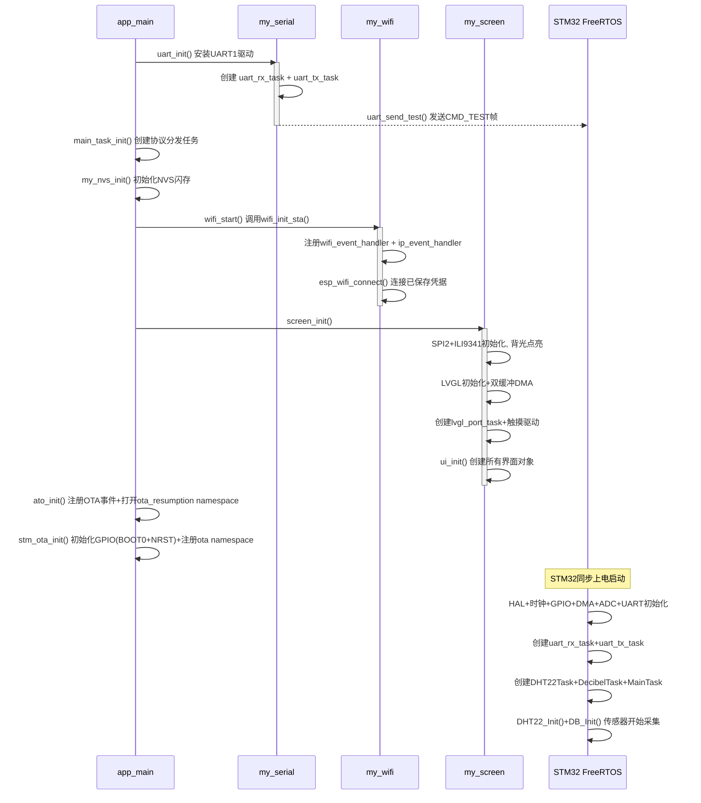
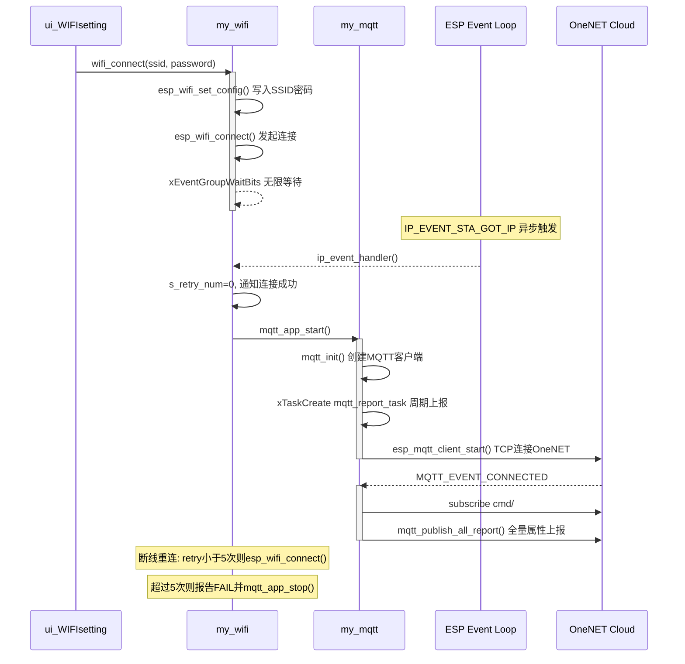
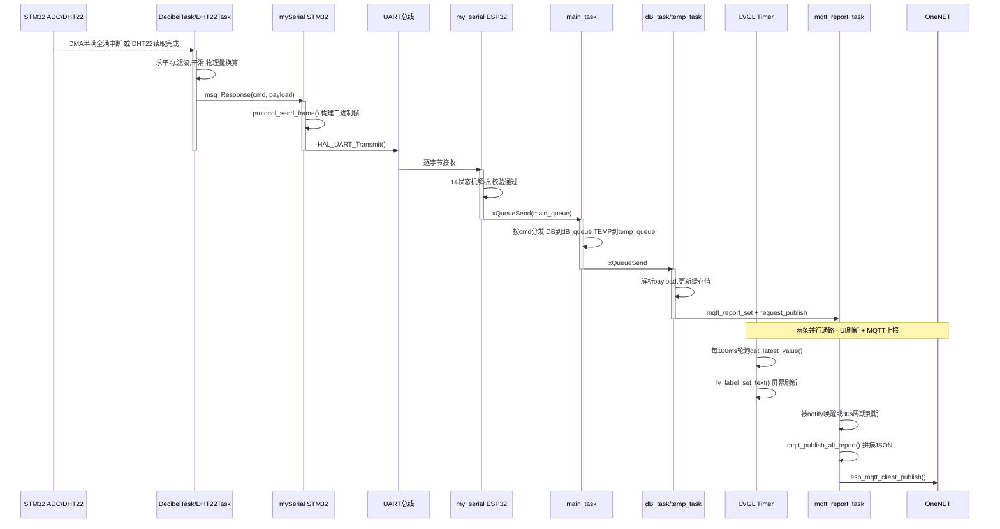
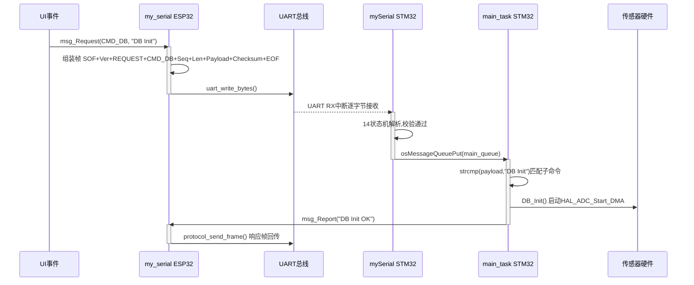
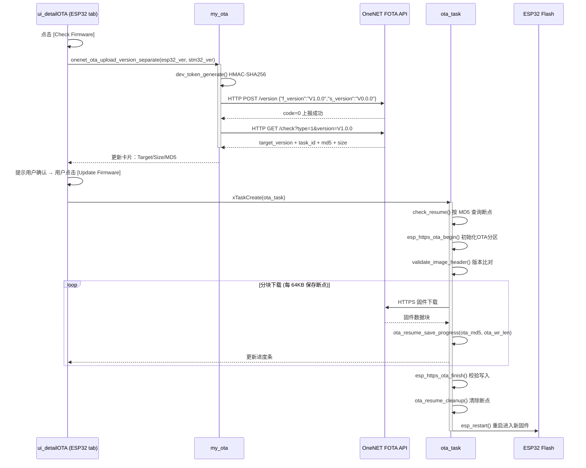
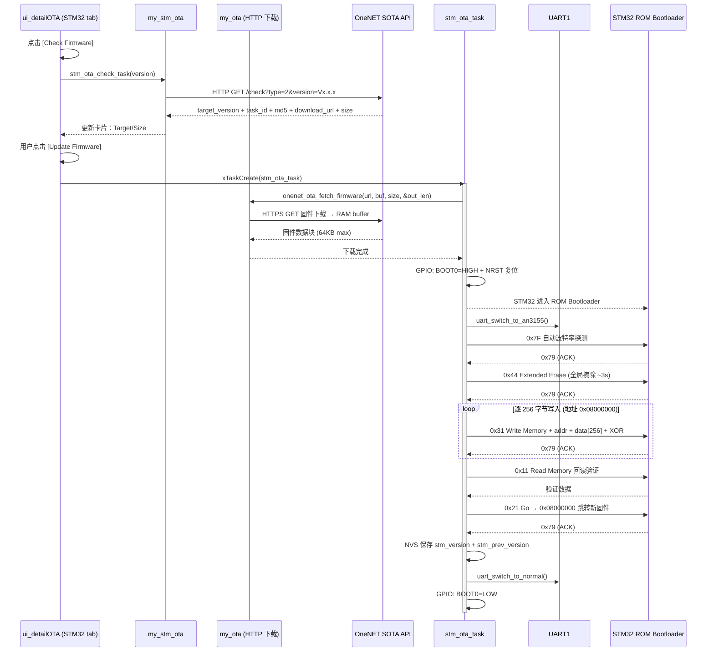

# 基于 STM32 + ESP32 的双板环境监测系统

## 项目定位

一个从零搭建的嵌入式物联网综合项目，覆盖**传感器采集 → 数据解析 → 本地显示 → 云端上报 → 远程控制 → 双芯片 OTA 固件升级**完整链路。系统使用两块 MCU 分工协作：**STM32F103C8T6** 作为下位机负责传感器控制与数据采集，**ESP32-S3** 作为上位机负责网络通信、MQTT 云端交互、LVGL 触摸屏人机界面，同时也是 STM32 的 **OTA 网关**（通过 AN3155 ROM Bootloader 协议烧写 STM32 固件）。

## 项目背景与学习目标

这是我的第一个综合性嵌入式项目。在学习过程中，我分别接触过传感器驱动、FreeRTOS 任务调度、WiFi 联网、MQTT 协议、LVGL 图形界面等独立知识点，但从未将它们整合为一个完整系统。这个项目的目的就是把这些分散的技能点串成一条端到端的数据链路，理解"数据从哪里来、经过哪些环节、最终到哪里去"。

通过这个项目，我掌握了：

- STM32 与 ESP32 双 MCU 之间自定义二进制通信协议的设计与实现
- FreeRTOS 多任务编程：队列、事件组、任务通知、互斥锁、状态机
- LVGL 图形库的使用和 SquareLine Studio 可视化 UI 设计
- MQTT 协议接入 OneNET 物联网平台（认证、主题设计、属性上报）
- ADC + DMA 循环双缓冲数据采集 + 数字滤波算法
- DHT22 单总线时序的精确控制（DWT 微秒延时 + 关中断原子操作）
- OneNET OTA 双芯片固件升级：ESP32 FOTA (模组固件) + STM32 SOTA (MCU软件)
- STM32 AN3155 ROM Bootloader 协议：GPIO 模式切换、Flash 擦除/烧写/验证
- OTA 断点续传与固件回滚机制（自动回滚 + 手动回滚）
- HMAC-SHA256 API 鉴权与 OneNET 云端对接
- NVS 持久化存储与 Wi-Fi 凭据管理
- ESP-IDF 组件化工程结构设计与 CMake 构建系统
- 嵌入式系统中常见架构问题的识别与改进思路

## 实物展示

> 请在此处添加你的项目实物照片。建议拍摄：

| 照片内容 | 建议文件名 | 说明 |
|---------|-----------|------|
| 整体接线俯视图 | `docs/images/overview.jpg` | 展示两块板子和所有外设的完整连线 |
| ESP32-S3 + 屏幕 | `docs/images/esp32_screen.jpg` | ESP32 连接 ILI9341 屏幕的近景 |
| STM32 + 传感器 | `docs/images/stm32_sensors.jpg` | STM32 连接 DHT22 和分贝模块 |
| 屏幕界面截图 | `docs/images/ui_main.jpg` | LVGL 主界面运行效果 |
| OLED 调试显示 | `docs/images/oled_debug.jpg` | STM32 OLED 显示的实时数据 |


### 参考硬件图片链接

在实际拍照之前，以下链接可查看各模块的外观（均为官方或权威来源，链接相对稳定）：

| 模块 | 参考链接 |
|------|---------|
| ESP32-S3-DevKitC-1 | [Espressif 官方文档](https://docs.espressif.com/projects/esp-idf/en/stable/esp32s3/hw-reference/esp32s3/user-guide-devkitc-1.html) |
| STM32F103C8T6 最小系统板 | [STM32 Blue Pill Wiki](https://stm32-base.org/boards/STM32F103C8T6-Blue-Pill) |
| 2.8" ILI9341 SPI TFT + XPT2046 | [LCD Wiki](http://www.lcdwiki.com/2.8inch_SPI_Module_ILI9341_SKU:MSP2807) |
| DHT22 温湿度传感器 | [Adafruit 产品页](https://www.adafruit.com/product/385) |
| 0.96" SSD1306 OLED (I2C) | [Adafruit 产品页](https://www.adafruit.com/product/326) |

## 核心指标

| 维度 | 说明 |
|------|------|
| 主控芯片 | STM32F103C8T6（ARM Cortex-M3, 72MHz）+ ESP32-S3（Xtensa LX7, 240MHz） |
| 传感器 | DHT22 温湿度、模拟分贝计（ADC 采集） |
| 板间通信 | UART 自定义二进制协议，115200bps |
| 本地显示 | 2.8" ILI9341 SPI 触摸屏 (240×320)，LVGL v9.2 渲染，XPT2046 触摸 |
| 调试显示 | 0.96" SSD1306 OLED (I2C, 128×64) |
| 云端平台 | OneNET 物联网平台，MQTT 协议 |
| 网络能力 | Wi-Fi STA 模式、SNTP 网络时间同步 |
| 固件升级 | OneNET OTA 远程固件升级（HTTPS），支持 ESP32 (FOTA) + STM32 (SOTA/AN3155) |
| 操作系统 | FreeRTOS（双端均使用） |
| ESP32 框架 | ESP-IDF v5.x + CMake |
| STM32 框架 | STM32Cube HAL + PlatformIO |
| UI 设计工具 | SquareLine Studio 1.6.1 |

---

## 系统总体架构

### 为什么用双板？

如果只用 STM32，它没有 WiFi 能力，无法联网，也带不动 LVGL 触摸屏。如果只用 ESP32-S3，它的 ADC 精度不如 STM32，GPIO 抗干扰能力也偏弱，且没有 5V 容忍引脚。两块板各司其职，通过串口协作，是嵌入式系统中常见的架构模式。这种模式的核心理念是**将实时性要求高、硬件绑定的底层任务与计算密集、交互复杂的上层任务分离到不同 MCU 上执行**。此外，ESP32-S3 还充当 STM32 的 **OTA 网关**——通过 AN3155 协议经 UART + GPIO 控制 STM32 的固件烧写，使 STM32 也具备远程固件升级能力。

### 系统拓扑

```text
                        ┌─────────────┐
                        │  OneNET 云平台 │
                        │  (MQTT Broker) │
                        │   + OTA Server │
                        └──────┬──────┘
                               │ MQTT + HTTPS (WiFi)
   ┌───────────────────────────┼───────────────────────────┐
   │                     ESP32-S3                          │
   │  ┌──────────┐  ┌──────────┐  ┌──────────────────┐   │
   │  │  WiFi STA │  │ SNTP 时间 │  │ LVGL 触摸屏      │   │
   │  │  + MQTT   │  │   同步    │  │ (ILI9341+XPT2046)│   │
   │  │  + OTA    │  │           │  │                  │   │
   │  └──────────┘  └──────────┘  └──────────────────┘   │
   │                         │                             │
   │                    UART1 (115200)                     │
   │           自定义二进制协议 + AN3155 OTA                │
   │           GPIO14 ── BOOT0 (烧写模式切换)               │
   │           GPIO13 ── NRST  (复位控制)                  │
   └─────────────────────────┼───────────────────────────┘
                             │
   ┌─────────────────────────┼───────────────────────────┐
   │                     STM32F103C8                      │
   │  ┌──────────┐  ┌──────────┐  ┌──────────────────┐   │
   │  │ DHT22    │  │ 分贝模块  │  │ OLED 调试屏       │   │
   │  │ (PB0)    │  │ (PB1 ADC) │  │ (I2C, 本地调试)  │   │
   │  └──────────┘  └──────────┘  └──────────────────┘   │
   │                                                       │
   │  ROM Bootloader (USART1) ← AN3155 协议烧写固件       │
   └──────────────────────────────────────────────────────┘
```

### 数据流（两条链路）

**上行链路（采集 → 显示 → 云端）：**

```
传感器 → STM32 ADC/GPIO → DMA缓冲 → 滤波算法 → 协议帧
  → UART → ESP32 状态机解析 → 主任务队列分发
    → LVGL 界面更新 + MQTT JSON 上报 → OneNET 平台
```

**下行链路（界面/云端 → 控制传感器）：**

```
触摸屏点击 / MQTT 云端命令 → ESP32 发送请求帧
  → UART → STM32 解析子命令 → 使能/停用传感器
    → 返回上报帧确认执行结果
```

### 技术栈详情

#### ESP32-S3 侧

| 层级 | 技术/组件 | 用途 |
|------|-----------|------|
| 构建系统 | ESP-IDF v5.x + CMake | 项目构建、menuconfig 配置管理 |
| 实时操作系统 | FreeRTOS (原生 API) | 任务调度、队列通信、事件组同步 |
| 网络层 | ESP-NETIF + LwIP | TCP/IP 协议栈 |
| Wi-Fi | ESP-WIFI | STA 模式连接、AP 扫描、自动重连 |
| 应用协议 | MQTT (esp-mqtt client) | OneNET 平台数据上报与命令订阅 |
| 时间同步 | SNTP (lwip/apps) | 从 NTP 服务器获取 UTC+8 时间 |
| 文件系统 | NVS (Non-Volatile Storage) | Wi-Fi 凭据、固件版本号持久化存储 |
| 图形界面 | LVGL v9.2.2 | 10 个页面的渲染、动画、事件处理 |
| UI 设计工具 | SquareLine Studio 1.6.1 | 可视化拖拽生成 LVGL 界面代码 |
| 显示屏驱动 | esp_lcd_ili9341 | ILI9341 SPI 屏幕初始化与数据传输 |
| 触摸驱动 | esp_lcd_touch_xpt2046 | XPT2046 电阻触摸坐标读取与映射 |
| 串口通信 | UART1 (esp_driver_uart) | 与 STM32 双向二进制协议通信 |
| OTA 升级 | esp_https_ota + AN3155 | ESP32 OTA (FOTA, type=1) + STM32 OTA (SOTA, type=2) |
| 加密/认证 | mbedtls (HMAC-SHA256, Base64) | OneNET API 鉴权 token 生成 |
| JSON 解析 | cJSON | OTA 接口响应解析、MQTT 数据组织 |

#### STM32F103C8T6 侧

| 层级 | 技术/组件 | 用途 |
|------|-----------|------|
| 构建系统 | PlatformIO (GCC ARM) | 编译、烧录、串口监控 |
| 硬件抽象层 | STM32Cube HAL | GPIO、ADC、DMA、UART、I2C 硬件驱动 |
| 实时操作系统 | FreeRTOS (CMSIS-OS v2 封装) | 任务调度、消息队列、线程标志 |
| ADC 采集 | ADC1 + DMA 循环模式 | 分贝传感器连续采样（50 点双缓冲） |
| 精确定时 | DWT (Data Watchpoint) CYCCNT | 微秒级延时（DHT22 时序要求） |
| 单总线协议 | GPIO 位操作 + 关中断 | DHT22 温湿度传感器通信 |
| 串口通信 | USART1 (中断接收) | 与 ESP32-S3 双向二进制协议通信 |
| 调试显示 | OLED (I2C, SSD1306) | 本地实时显示传感器原始值和状态 |

#### FreeRTOS 任务列表（ESP32-S3 侧）

| 任务名称 | 优先级 | 栈大小 | 职责 |
|---------|--------|--------|------|
| `uart_event_task` | configMAX-1 | 4096B | 串口接收 + 协议帧状态机逐字节解析 |
| `uart_tx_task` | configMAX-2 | 3072B | 协议帧构建 + 串口发送 |
| `main_task` | 10 | 4096B | 协议消息分发（命令 → 业务队列） |
| `lvgl_port_task` | 5 | 8192B | LVGL 渲染循环 + 空闲锁屏轮询 |
| `dB_task` | 10 | 2048B | 分贝数据接收与缓存更新 |
| `temp_task` | 10 | 2048B | 温湿度数据解析与缓存更新 |
| `mqtt_report_task` | 5 | 4096B | 定时 + 按需 MQTT 属性上报 |
| `wifi_scan_task` | 5 | 4096B | Wi-Fi 扫描（按需创建，完成后自删） |
| `ota_task` | 5 | 8192B | ESP32 OTA 固件下载与刷写（按需创建） |
| `stm_ota_task` | 5 | 8192B | STM32 OTA 固件下载与 AN3155 烧写（按需创建） |

#### FreeRTOS 任务列表（STM32F103C8T6 侧）

| 任务名称 | 优先级 | 栈大小 | 职责 |
|---------|--------|--------|------|
| `UART_RX_TASK` | osPriorityHigh | 512B | 串口中断接收 + 协议帧状态机解析 |
| `UART_TX_TASK` | osPriorityAboveNormal | 512B | 协议帧构建 + 串口发送 |
| `MainTask` | osPriorityAboveNormal | 512B | 命令解析（请求帧 → 传感器控制） |
| `Decibel` | osPriorityAboveNormal | 512B | ADC DMA 数据处理 + 滤波 + 上报 |
| `DHT22Task` | osPriorityAboveNormal | 512B | DHT22 读取 + 温湿度解析 + 上报 |

> **关于 API 不一致的说明：** ESP32-S3 侧使用 FreeRTOS 原生 API（`xQueueCreate`、`xTaskCreate`），因为 ESP-IDF 本身就是基于 FreeRTOS 构建的。STM32 侧使用 CMSIS-OS v2 封装（`osMessageQueueNew`、`osThreadNew`），因为 STM32CubeMX 默认生成这个风格。两者底层都是 FreeRTOS，行为一致，只是 API 名称不同。

---

## 硬件连接与引脚映射

### ESP32-S3 引脚分配

#### LCD 屏 + 触摸（共用 SPI2 总线）

| 引脚功能 | GPIO | 说明 |
|---------|------|------|
| SCLK (SPI 时钟) | 6 | SPI2 总线时钟，LCD 与触摸共用 |
| MOSI (主机输出) | 7 | SPI2 数据输出 |
| MISO (主机输入) | 8 | SPI2 数据输入 |
| DC (数据/命令) | 5 | LCD 专用：高电平=数据，低电平=命令 |
| CS (LCD 片选) | 4 | LCD 专用片选 |
| RST (LCD 复位) | 9 | LCD 专用复位，低电平有效 |
| BK_LIGHT (背光) | 10 | 高电平点亮 |
| CS (触摸片选) | 11 | 触摸专用片选，与 LCD 共享 SPI 总线 |

#### UART1（与 STM32 通信 + OTA 烧写）

| 引脚功能 | GPIO | 方向 | 说明 |
|---------|------|------|------|
| TX | 17 | ESP32 → STM32 | 协议通信 + AN3155 命令发送 |
| RX | 16 | STM32 → ESP32 | 协议通信 + AN3155 响应接收 |

#### STM32 OTA 控制（my_stm_ota）

| 引脚功能 | GPIO | 方向 | 说明 |
|---------|------|------|------|
| BOOT0 | 14 | ESP32 → STM32 | HIGH=System Memory (ROM Bootloader), LOW=Flash (用户程序) |
| NRST | 13 | ESP32 → STM32 | 开漏输出，LOW 脉冲复位 STM32（配合 BOOT0 切换模式） |

> **GPIO 选型注意：** BOOT0 使用 GPIO14 而非 GPIO12，因为 GPIO12 是 ESP32-S3 的 strapping pin (MTDI)，上电时影响 Flash 电压配置。NRST 使用开漏输出 + 外部/内部上拉，避免与 STM32 内部复位电路产生电平冲突。

### STM32F103C8T6 引脚分配

| 外设 | 引脚 | 功能 |
|------|------|------|
| USART1 TX | PA9 | STM32 → ESP32 |
| USART1 RX | PA10 | ESP32 → STM32 |
| DHT22 数据 | PB0 | 单总线双向通信，需外部上拉电阻 |
| 分贝模拟输入 | PB1 | ADC1_IN9，模拟电压采集 |
| OLED SCL | PB6 | I2C1 时钟 |
| OLED SDA | PB7 | I2C1 数据 |

### 板间连接

```text
ESP32-S3              STM32F103C8T6
  GPIO17 (TX)  ────────► PA10 (RX)     ← UART 数据
  GPIO16 (RX)  ◄──────── PA9  (TX)     ← UART 数据
  GPIO14 (BOOT0) ──────► BOOT0         ← 模式切换：HIGH=Bootloader, LOW=Flash
  GPIO13 (NRST) ──────► NRST          ← 复位控制（开漏 + 外部上拉）
  GND          ───────── GND           ← 必须共地！
```

> **为什么要共地？** UART 通信依赖电压差来判断逻辑电平（0/1）。如果两块板子没有共同的参考地，接收方读到的电压是发送方电压 + 两地之间的浮动电压差，导致逻辑判断错误，通信失败。
>
> **BOOT0 / NRST 的作用：** 正常运行时 BOOT0=LOW，STM32 从 Flash 启动用户程序。进行 OTA 烧写时 ESP32 拉高 BOOT0 + 脉冲 NRST 复位，STM32 重启后进入 ROM Bootloader，ESP32 通过 AN3155 协议（经 UART1）烧写新固件。

---

## 通信协议

### 为什么用自定义二进制协议？

| 方案 | 问题 |
|------|------|
| AT 指令 | 文本协议解析成本高，每个命令都需要字符串匹配，不适合高频数据传输 |
| Modbus | 标准协议但帧开销大，对于只有几个传感器的小系统来说过于复杂 |
| 自定义二进制 | 结构紧凑（最小帧仅 12 字节）、解析高效（状态机一次遍历）、扩展灵活（新增命令只需增加枚举值） |

### 协议帧格式

```
Byte Offset:  0    1    2    3    4    5    6    7    8    9    10+N  12+N 13+N
            ┌────┬────┬────┬────┬────┬────┬────┬────┬────┬─────┬─────┬─────┬─────┐
            │0x55│0xAA│ Ver│Type│ Cmd│SeqL│SeqH│LenL│LenH│ Pay │CkSum│0x0D │0x0A │
            │ SOF    │ 1B │ 1B │ 1B │ 2B(Little)│ 2B(Little)│0~128│ 2B  │ EOF    │
            └────┴────┴────┴────┴────┴────┴────┴────┴────┴─────┴─────┴─────┴─────┘
最小帧长: 12 字节 (PayloadLen=0)
最大帧长: 140 字节 (PayloadLen=128)
```

多字节字段（Seq、PayloadLen、Checksum）使用**小端序**（Little-Endian），与 Cortex-M 和 Xtensa 处理器原生字节序一致。

### 字段说明

| 字段 | 偏移 | 长度 | 说明 |
|------|------|------|------|
| SOF | 0 | 2B | 帧头 `0x55 0xAA`，用于帧同步 |
| Version | 2 | 1B | 协议版本号，当前为 `0x01`（预留扩展） |
| MsgType | 3 | 1B | 0=请求(Request), 1=响应(Response), 2=上报(Report) |
| Cmd | 4 | 1B | 命令码（见下方命令定义） |
| Seq | 5 | 2B | 序列号，每发一条消息自增（用于请求-响应匹配，预留） |
| PayloadLen | 7 | 2B | 载荷字节数，0~128 |
| Payload | 9 | N | 实际数据 |
| Checksum | 9+N | 2B | 累加校验和（覆盖 Ver + Type + Cmd + Seq + Len + Payload） |
| EOF | 11+N | 2B | 帧尾 `0x0D 0x0A`，用于帧结束确认 |

### 校验和算法

```c
checksum = Ver + MsgType + Cmd + Seq_L + Seq_H + Len_L + Len_H + sum(Payload[0..N-1])
// 累加溢出自动截断为 uint16_t
```

这是**累加和校验**，不是 CRC。优点：计算极快，不需要查表；缺点：检测能力不如 CRC（无法检测字节顺序交换）。对于板间短距离 UART 通信（硬件已做奇偶校验和帧错误检测），累加和足够使用。

### 命令定义

| 命令码 | 枚举名 | 用途 | 数据方向 |
|--------|--------|------|---------|
| `0xAA` | CMD_TEST | 通信测试，Payload 通常为空 | 双向 |
| `0x01` | CMD_TEMPERATURE | 温湿度传感器控制与数据 | 双向（请求=控制, 响应=温湿度数据） |
| `0x02` | CMD_DB | 分贝模块控制与数据 | 双向（请求=控制, 响应/上报=分贝数据） |
| `0x03` | CMD_LIGHT | 光照传感器（已预留，待实现） | 预留 |
| `0x04` | CMD_VERSION | STM32 固件版本查询（OTA 用） | ESP32 → STM32 请求，STM32 返回版本号 |

### 状态机解析流程

协议解析的核心是一个 14 状态的状态机，逐字节驱动。以 ESP32 端为例：

```
RX_WAIT_SOF1 ──[0x55]──► RX_WAIT_SOF2 ──[0xAA]──► RX_READ_VER
                                                      │
   [任意状态收到意外字节时回退到 RX_WAIT_SOF1]            │
                                                      ▼
RX_READ_EOF2 ◄── RX_READ_EOF1 ◄── RX_READ_CRC_H ◄── RX_READ_CRC_L
    │                                                      ▲
    │ [0x0A]                                               │
    ▼                                                      │
 校验通过 ──► main_queue ──► main_task 分发 ──► temp_queue / dB_queue
 校验失败 ──► 丢弃，打印 WARNING ──► RX_WAIT_SOF1
```

**关键设计决策：**
- ESP32 使用事件驱动批量读取（`uart_read_bytes` 一次最多 128 字节后逐字节喂给状态机），比逐字节中断效率高
- STM32 使用中断逐字节接收后推入队列，延迟更低但吞吐稍低。对于本项目的数据量级两种方式都绰绰有余
- 不完整帧自动丢弃，不会累积错误（无"试图修复"的逻辑，简单可靠）
- `RX_READ_LEN_H` 后立即检查 `payload_len > 128`，防止恶意帧导致缓冲区溢出

### ESP32 端主任务分发逻辑

`main_task` 从 `main_queue` 收到解析完成的帧后的路由决策：

```
if msg_type == REQUEST  → 忽略（ESP32 不处理请求，那是 STM32 的职责）
if cmd == TEMPERATURE   → 转到 temp_queue（温湿度任务消费 4 字节二进制数据）
if msg_type == RESPONSE && cmd == DB → atof(payload) → 转到 dB_queue
if msg_type == REPORT   && cmd == DB → atof(payload) → 转到 dB_queue
```

这里隐含了一个约定：**温湿度数据通过 cmd 路由，分贝数据通过 msg_type + cmd 双重过滤后以 float 形式路由**。这是因为 STM32 的温湿度 payload 是 4 字节二进制数据（int16_t × 2），不能直接 `atof()`。

---

## 功能模块详解

### 1. Wi-Fi 联网（my_wifi）

ESP32-S3 以 STA 模式连接路由器，支持三套配置来源：

1. **menuconfig 默认配置** — 编译时预设 SSID 和密码（Kconfig 配置项 `CONFIG_MY_WIFI_SSID` / `CONFIG_MY_WIFI_PASSWORD`）
2. **NVS 持久化存储** — 手动连接成功后自动保存凭据，下次启动优先使用
3. **触摸屏手动选择** — 在 Wi-Fi 设置界面扫描附近 AP，选择后输入密码连接

#### 事件驱动架构

ESP32 的 Wi-Fi 和 IP 是两个独立的事件源，必须分开注册：

```c
esp_event_handler_instance_register(WIFI_EVENT, ESP_EVENT_ANY_ID, &wifi_event_handler, ...);
esp_event_handler_instance_register(IP_EVENT,   IP_EVENT_STA_GOT_IP, &ip_event_handler, ...);
```

关键事件流：

```
esp_wifi_start() → WIFI_EVENT_STA_START → [有凭据] → esp_wifi_connect()
    ↓
WIFI_EVENT_STA_CONNECTED → DHCP → IP_EVENT_STA_GOT_IP → 触发 MQTT/SNTP
    ↓ (断线)
WIFI_EVENT_STA_DISCONNECTED → [自动模式] → esp_wifi_connect() 重试（最多5次）
                            → [手动断开] → 不做任何事，等待用户操作
```

#### 状态管理

```c
static uint8_t s_retry_num = 0;          // 当前重试次数（连接成功后清零）
static bool s_user_disconnect = false;    // 用户主动断开标志
static bool s_manual_connecting = false;  // 手动连接正在执行标志
```

三个变量的协作用例：
- **正常自动连接**：`s_manual_connecting=false` → WIFI_EVENT_STA_START 时自动连接
- **手动连接**：`s_manual_connecting=true` → 阻止自动连接逻辑（避免重复），完成后重置
- **手动断开**：`s_user_disconnect=true` → 断线事件中识别这是用户主动行为，跳过重连

#### Wi-Fi 凭据持久化

连接成功后自动写入 NVS：`wifi_ssid` / `wifi_pass`。下次启动时优先从 NVS 读取，menuconfig 中的默认凭据作为兜底。

#### Wi-Fi 扫描功能（wifi_scan）

- 在独立 FreeRTOS 任务中执行同步扫描（可阻塞），避免阻塞 UI 线程
- 扫描结果通过 `lv_async_call` 异步推送到 LVGL 下拉框更新
- 任务完成后自删除（`vTaskDelete(NULL)`），避免资源浪费

#### 已解决问题：WPA3 兼容性

代码中保留了 `EXAMPLE_H2E_IDENTIFIER` 的定义但注释掉了。实际测试中发现设置 H2E 标识符后连接失败。最终方案是兼容 WPA/WPA2/WPA3 混合模式（`WIFI_AUTH_WPA3_PSK` 作为阈值，实际协商时降级到路由器支持的最高安全等级）。

---

### 2. MQTT 云端通信（my_mqtt）

#### OneNET 平台 MQTT 接入规范

OneNET 的 MQTT 接入与标准 MQTT 的区别主要在**认证方式**和**主题命名规则**：

| 参数 | OneNET 要求 | 本项目配置 |
|------|-----------|-----------|
| clientId | 必须等于设备名称 | `ONENET_DEVICE_NAME` |
| username | 必须等于产品 ID | `ONENET_PRODUCT_ID` |
| password | 设备 Key 生成的 Token | `ONENET_TOKEN` (menuconfig 配置) |
| 属性上报 topic | `$sys/{pid}/{dev}/thing/property/post` | 固定公式拼接 |
| 命令下发 topic | `$sys/{pid}/{dev}/cmd/#` | 通配订阅所有命令 |

#### 自动订阅的主题

| 主题 | 用途 | 当前状态 |
|------|------|---------|
| `$sys/{pid}/{dev}/cmd/#` | 云端命令下发 | 已订阅，处理逻辑待补完 |
| `$sys/{pid}/{dev}/thing/property/post/reply` | 属性上报回执 | 已订阅，观察平台交互结果 |
| `$sys/{pid}/{dev}/thing/property/set` | 属性设置 | 已订阅，处理逻辑待补完 |

#### 属性上报数据管理（mqtt_report）

采用注册表模式管理上报项：

```c
static mqtt_report_item_t s_items[16] = {
    {.key = "connect_status", .type = MQTT_REPORT_BOOL},  // 连接状态
    {.key = "dB_value",      .type = MQTT_REPORT_FLOAT},  // 分贝值
    {.key = "temp_value",    .type = MQTT_REPORT_FLOAT},  // 温度值
    {.key = "humi_value",    .type = MQTT_REPORT_FLOAT},  // 湿度值
};
```

- 每个 item 有独立的 `valid` 标志位，未获取到数据时不会上报
- 写操作通过 `mqtt_report_set_float/bool/int` 统一接口，内部用 FreeRTOS 互斥锁保护
- 后续新增传感器只需在数组中追加条目，无需修改上报逻辑

#### 上报的 JSON 格式

```json
{
  "id": "1234567890",
  "version": "1.0",
  "params": {
    "connect_status": {"value": true},
    "dB_value": {"value": 45.20},
    "temp_value": {"value": 26.30},
    "humi_value": {"value": 65.80}
  }
}
```

JSON 使用 `snprintf` 逐字段拼接（而非 cJSON）。这是有意识的选择：MQTT 上报是高频操作（数秒一次），JSON 结构简单且固定，`snprintf` 拼接比 cJSON 创建对象/序列化快很多。OTA 模块因为 API 响应 JSON 结构复杂且会变化，则使用了 cJSON 解析。

#### 上报调度机制

双重触发策略：

1. **按需触发**：传感器数据更新后调用 `mqtt_report_request_publish()` → 任务通知 → 立即上报
2. **周期兜底**：`mqtt_report_task` 的 `ulTaskNotifyTake` 有 30 秒超时，即使没有按需触发也会定期上报

既保证了数据变化的实时性，又有心跳保活的作用。

---

### 3. LVGL 触摸屏界面（my_screen + my_ui）

#### 硬件配置

- **显示屏**：2.8 英寸 ILI9341，240×320 分辨率，SPI 接口（SPI2_HOST），16 位色深 RGB565
- **触摸**：XPT2046 电阻触摸控制器，共用 SPI 总线，独立片选（GPIO11）
- **刷新策略**：局部刷新（40 行缓冲 × 2 = 双缓冲），DMA 传输
- **像素时钟**：20MHz

#### 初始化流程

```
1.  GPIO 背光引脚配置
2.  SPI 总线初始化（SPI2_HOST, 20MHz, DMA_CH_AUTO）
3.  LCD 面板 IO 创建（绑定 DC/CS 到 SPI）
4.  ILI9341 驱动初始化（复位 → 配置 → 开显示 + 水平镜像）
5.  背光开启
6.  LVGL 初始化（创建 display → 分配 DMA 双缓冲 → RGB565 颜色格式 → 注册刷新回调）
7.  LVGL tick 定时器启动（esp_timer, 2ms 周期）
8.  IO 事件回调注册（帧传输完成 → notify_lvgl_flush_ready）
9.  触摸初始化（独立 SPI IO + XPT2046 驱动 + 坐标映射）
10. LVGL 任务创建（8192B 栈, 优先级 5）
11. UI 初始化（ui_init） + 空闲锁屏初始化（5 分钟超时）
```

#### 双缓冲 + 局部刷新

```c
void *buf1 = spi_bus_dma_memory_alloc(HSPI_HOST, fb_size, 0);
void *buf2 = spi_bus_dma_memory_alloc(HSPI_HOST, fb_size, 0);
lv_display_set_buffers(disp, buf1, buf2, fb_size, LV_DISPLAY_RENDER_MODE_PARTIAL);
```

- 每个缓冲区 240×40 像素 × 2 字节 = 19.2KB，两块共 38.4KB
- 全屏需要 240×320×2 = 150KB，局部刷新将内存需求降低了 75%
- 刷新流程：GPU 渲染到 buf1 → DMA 传输 buf1 到屏幕 → 同时 GPU 渲染下一块到 buf2

#### 屏幕旋转

`lcd_port_update_callback` 在每次 LVGL 刷新前检查旋转设置并同步 LCD 硬件参数。LVGL 设置旋转后只更新自己的内部坐标映射，**不会自动修改** LCD 硬件的 mirror 和 swap_xy 参数，必须在这个回调中手动同步。

#### 触摸坐标校准

XPT2046 返回的原始坐标范围经实测约为 X: 10~225, Y: 10~310，通过线性映射转换到屏幕坐标 0~239 和 0~319，并带有边界保护。

#### 界面结构

```
主界面 (main01) ──左右滑──► main02 ──► main03 ──► main04
    │                    （更多传感器数据页，待扩展）
    │ 点击时钟区域
    ├──► 时间详情页 ── 年月日/时分秒/星期缩写 + SNTP 同步控制 + 手动设时
    │ 点击分贝区域
    ├──► 分贝详情页 ── 实时分贝数值 + 最大/最小/平均统计
    │ 点击温度区域
    ├──► 温湿度详情页 ── 温度 + 湿度双列显示 + 最大/最小/平均统计
    │ 点击光照区域
    ├──► 光照详情页 ── 实时光照数值 + 开关控制
    │ 下滑手势
    └──► 设置页面 ── Wi-Fi 开关 + OTA 检查入口
               │
               ├──► Wi-Fi 设置页 ── AP 扫描列表 + 密码输入键盘 + 连接按钮
               └──► OTA 详情页 ── [ESP32]/[STM32] 芯片切换 + 版本卡片 + 两段式升级 + 回滚

空闲 5 分钟 ──► 锁屏页 ── 实时时间/日期 + 呼吸光晕动画 + 点击或左滑解锁
```

#### 完整界面清单

| 界面 | 生成文件 | 业务逻辑文件 | 触发方式 |
|------|---------|------------|---------|
| 主界面 1 | `ui_main01.c` | `detail_time_logic.c` / `detail_dB_logic.c` / `detail_temp_logic.c` / `detail_light_logic.c` | 启动默认 |
| 主界面 2-4 | `ui_main02~04.c` | — | 左右滑动 |
| 时间详情 | `ui_detailTime.c` | `detail_time_logic.c` | 点击时钟区域 |
| 温湿度详情 | `ui_detailTemperature.c` | `detail_temp_logic.c` | 点击温度区域 |
| 分贝详情 | `ui_detialDB.c` | `detail_dB_logic.c` | 点击分贝区域 |
| 光照详情 | `ui_detialLight.c` | `detail_light_logic.c` | 点击光照区域 |
| 设置 | `ui_setting.c` | — | 下滑手势 |
| Wi-Fi 设置 | `ui_WIFIsetting.c` | `wifi_scan.c` | 点击 WiFi 标签 |
| OTA 详情 | `ui_detailOTA.c` | `my_ota.c` + `my_stm_ota.c` | 点击 OTA 标签（芯片切换条：ESP32/STM32） |
| 锁屏 | `ui_ScreenLock.c` | `screen_idle_lock.c` | 5 分钟无操作（显示实时时钟+呼吸动画） |

#### 线程安全

- LVGL 不是线程安全的，所有 LVGL API 调用必须持有 `lvgl_api_lock` 互斥锁
- 跨任务更新 UI 使用 `lv_async_call`（Wi-Fi 扫描结果更新下拉框）或 LVGL 定时器（传感器数据每秒刷新）
- 触摸坐标采集在 LCD 刷新回调中，天然在 LVGL 线程内

#### SquareLine Studio 工作流

所有 `ui_*.c` 文件由 SquareLine Studio 1.6.1 生成（LVGL 9.2.2），遵循以下约定：

- 每个界面一对函数：`ui_XXX_screen_init()` 创建所有对象，`ui_XXX_screen_destroy()` 删除并置 NULL
- 事件回调命名：`ui_event_XXX()`
- 跨界面切换使用 `_ui_screen_change()` 辅助函数
- **不要直接修改生成的 `ui_*.c` 文件**，业务逻辑写在 `detail_*_logic.c` 中

---

### 4. 时间同步（detail_time_logic）

#### SNTP 初始化参数

```c
setenv("TZ", "CST-8", 1);               // 中国标准时间 UTC+8
esp_sntp_setoperatingmode(SNTP_OPMODE_POLL);
esp_sntp_setservername(0, "pool.ntp.org");    // 国际 NTP 池
esp_sntp_setservername(1, "ntp.ntsc.ac.cn");  // 中科院国家授时中心
sntp_set_sync_interval(3600000);              // 每小时同步一次
```

#### 时间更新链路

```
SNTP 同步成功 → time_sync_notification_cb (打印日志确认)
       ↓
系统时间更新 (settimeofday)
       ↓
lv_timer(1000ms) → time_update_callback()
       ↓
localtime(&now) → strftime → lv_label_set_text (各 UI 标签)
```

- 两个独立定时器：SNTP 同步（1 小时周期，系统级），LVGL 显示更新（1 秒周期，界面级）
- 时间在两个位置显示：主界面顶部 + 时间详情页

---

### 5. 分贝检测（db.c + detail_dB_logic）

#### 采集链路

```
PB1(AIN9) → ADC1 → DMA(50点循环双缓冲) → 半满/全满回调
  → osThreadFlagsSet → 任务被唤醒
    → 半缓冲区求平均 → 移动平均滤波(5点) → 指数平滑(α=0.2)
      → ADC值线性映射到0~180dB → 响应帧回传 → ESP32 dB_task
        → 更新缓存 + 触发 MQTT 上报
          → LVGL 定时器(100ms) → 更新 ui_dBNum 标签
```

#### DMA 双缓冲机制

```c
#define ADC_BUF_SIZE 50
uint16_t adc_dma_buf[50];  // DMA 循环填充
```

- **半满中断**：前 25 个点就绪 → 任务处理 `buf[0..24]`
- **全满中断**：后 25 个点就绪 → 任务处理 `buf[25..49]`

CPU 处理前半部分时，DMA 继续填充后半部分，不会丢失任何采样点。

#### 滤波算法详解

**第一层 — 移动平均（窗口=5）：**

```c
filter_buf[idx] = adc_value;
idx = (idx + 1) % 5;
output = sum(filter_buf) / 5;
```

作用：消除 ADC 采样的随机高频毛刺。窗口 5 是经验值 — 太大会导致响应迟钝，太小滤波效果不明显。

**第二层 — 指数平滑（α=0.2）：**

```c
db_smooth = db_smooth * 0.8 + current_value * 0.2;
```

作用：让显示值"追赶"真实值而不是跳变。α=0.2 意味着每次更新只采纳 20% 的新值，保留 80% 的历史值。

#### ADC 值到分贝值的线性映射

```c
ratio = (adc - 200) / (3000 - 200);  // [200, 3000] → [0, 1]
dB = 0 + (180 - 0) * ratio;           // [0, 1] → [0, 180]
```

> **注意：** 这是线性映射产生的"伪分贝值"，绝对值不准确，但相对变化能反映声音大小变化趋势。如果需要真实 dB SPL 值，需要用标准声源做多点校准。

---

### 6. 温湿度检测（temperature.c + detail_temp_logic）

#### 采集链路

```
PB0 → DHT22 单总线协议
  → 发送起始信号(18ms 低电平 + 40μs 释放)
    → 等待 DHT22 应答(三段时序检查)
      → 逐位读取 40bit 原始数据(5 字节)
        → 校验和验证(Byte0+1+2+3 == Byte4)
          → 解析温度(int16_t) + 湿度(uint16_t) → 组装 4 字节 payload
            → 响应帧回传 → ESP32 temp_task → 更新缓存 + 触发 MQTT
```

#### DHT22 单总线协议时序

```
主机发送起始信号:
  ├── 拉低 18ms (唤醒传感器)
  └── 拉高 40μs (释放总线)

传感器应答:
  ├── 拉低 80μs
  └── 拉高 80μs

传感器发送 40 位数据 (5 字节, 高位先出):
  每个 bit:
    ├── 拉低 50μs (起始)
    └── 拉高 26~28μs → 逻辑 0
    └── 拉高 70μs    → 逻辑 1

数据格式:
  Byte0: 湿度整数   Byte1: 湿度小数
  Byte2: 温度整数 (Bit15=1 表示负温)   Byte3: 温度小数
  Byte4: 校验和 = (Byte0+1+2+3) & 0xFF
```

#### 微秒级精确定时

使用 DWT (Data Watchpoint and Trace) CYCCNT 寄存器：

```c
// 初始化
CoreDebug->DEMCR |= CoreDebug_DEMCR_TRCENA_Msk;
DWT->CYCCNT = 0;
DWT->CTRL |= DWT_CTRL_CYCCNTENA_Msk;
g_us_ticks_per_loop = SystemCoreClock / 1000000;  // 72MHz → 72 ticks/μs

// 微秒延时
void delay_us(uint32_t us) {
    uint32_t start = DWT->CYCCNT;
    uint32_t ticks = us * g_us_ticks_per_loop;
    while ((DWT->CYCCNT - start) < ticks);
}
```

DWT 是 Cortex-M3/M4 内置的调试单元，CYCCNT 以 CPU 主频递增。相比 `HAL_Delay`（依赖 SysTick, 最小精度 1ms），DWT 可以提供真正的微秒级精度。

#### 关中断保证时序原子性

```c
__disable_irq();
// ... DHT22 40 bit 读取过程 ...
__enable_irq();
```

DHT22 的 bit 判断依赖高电平持续时间的精确测量（26μs vs 70μs 的差别只有 44μs）。如果在读取过程中被 FreeRTOS 任务切换打断，可能导致时序误判。关中断保证了 40 bit 读取的原子性。整个读过程约 5ms，对系统实时性影响有限。

#### 数据传输格式（二进制定长）

STM32 采集到温湿度后，按以下格式打包为 4 字节：

```c
payload[0] = temp10 & 0xFF;        // 温度×10 的低字节 (int16_t, 支持负值)
payload[1] = (temp10 >> 8) & 0xFF; // 温度×10 的高字节
payload[2] = hum10 & 0xFF;         // 湿度×10 的低字节 (uint16_t)
payload[3] = (hum10 >> 8) & 0xFF;  // 湿度×10 的高字节
```

ESP32 端解析：

```c
int16_t temp_raw = payload[0] | (payload[1] << 8);
float temp = temp_raw / 10.0f;
```

与字符串传输相比（"26.3,65.8" 占 11 字节），二进制格式压缩到 4 字节，节省 64% 带宽，且解析无需 `sscanf`。

---

### 7. NVS 持久化存储（my_nvs）

#### 初始化流程

```c
my_nvs_init();  // 初始化 NVS 子系统 + 打开 "storage" 默认 namespace
// 内部自动处理 Flash 擦除和分区表兼容
nvs_open("storage", NVS_READWRITE, &handle);
// 注册到 namespace 注册表 (slot 0)
```

#### 多 Namespace 注册表

`my_nvs` 封装了一个轻量级的 namespace 注册表（最多 8 个槽位），统一管理所有 NVS 句柄的生命周期：

| API | 说明 |
|-----|------|
| `my_nvs_open_ns(ns)` | 按名称打开 namespace，自动注册到表中，已存在则跳过 |
| `my_nvs_close_ns(ns)` | 按名称关闭 namespace，从表中移除 |
| `my_nvs_get_handle(ns)` | 按名称查找句柄，未找到返回 0 |
| `my_nvs_register_handle(ns, h)` | 注册外部已打开的句柄 |
| `my_nvs_close_all()` | 关闭所有已注册的 namespace（关机/重启前清理） |
| `my_nvs_erase_all_ns(ns)` | 擦除指定 namespace 的全部数据并提交 |

**使用示例（OTA 断点续传）：**
```c
my_nvs_open_ns("ota_resumption");                  // 打开独立 namespace
nvs_handle_t h = my_nvs_get_handle("ota_resumption"); // 按名获取句柄
nvs_set_u32(h, "ota_wr_len", written_bytes);      // 写入断点
nvs_commit(h);                                     // 立即落盘
my_nvs_erase_all_ns("ota_resumption");             // OTA 成功后清理
```

#### 当前存储项

| Namespace | Key | 类型 | 写入方 | 写入时机 |
|-----------|-----|------|--------|---------|
| `storage` | `wifi_ssid` | string | `wifi_connect()` | 手动连接 Wi-Fi 成功后 |
| `storage` | `wifi_pass` | string | `wifi_connect()` | 手动连接 Wi-Fi 成功后 |
| `storage` | `app_version` | string | `get_app_verion()` | OTA 模块读取，需要外部写入 |
| `storage` | `prev_app_version` | string | `ota_rollback_to_previous()` | OTA 升级成功时自动保存旧版本号 |
| `ota` | `stm_version` | string | `stm_ota_flash()` | STM32 OTA 烧写成功后 |
| `ota` | `stm_prev_version` | string | `stm_ota_flash()` | STM32 OTA 烧写前保存旧版本号 |
| `ota_resumption` | `ota_md5` | string (33B) | `ota_resume_save_progress()` | ESP32 OTA 下载每 64KB 保存一次 |
| `ota_resumption` | `ota_wr_len` | u32 | `ota_resume_save_progress()` | ESP32 OTA 下载每 64KB 保存一次 |
| `ota_resumption` | `stm_ota_md5` | string | STM32 OTA 下载过程 | STM32 固件下载断点 MD5 |
| `ota_resumption` | `stm_ota_size` | u32 | STM32 OTA 下载过程 | STM32 固件已下载字节数 |

#### 封装层的价值

从最初的简单 set/get 封装发展为统一 namespace 管理器，支持：
- **句柄生命周期管理**：打开/关闭/查找统一入口，避免句柄泄漏
- **数据隔离**：不同模块使用独立 namespace（ESP32 OTA 断点用 `ota_resumption`，STM32 版本用 `ota`），擦除时互不影响
- **可切换性**：未来切换存储方式（SPIFFS/LittleFS）只需改 `my_nvs` 内部实现

---

### 8. OTA 固件升级（my_ota + my_stm_ota）

系统支持**两块芯片**的独立 OTA 升级，通过 OneNET 的两个通道区分：

| 通道 | OneNET type | 版本字段 | 负责组件 | 升级方式 |
|------|-----------|---------|---------|---------|
| 模组固件 (FOTA) | `"1"` | `f_version` | ESP32-S3 | `esp_https_ota` 直接写入 OTA 分区 |
| MCU软件 (SOTA) | `"2"` | `s_version` | STM32F103 | ESP32 下载固件到 RAM → AN3155 协议烧写 STM32 |

#### ESP32 OTA 升级流程（my_ota）

```
1. 上报版本 → POST /fuse-ota/{pid}/{dev}/version
       Body: {"f_version":"V1.0.0", "s_version":"V0.0.0"}
       （一次上报两块芯片的真实版本，分别对应 FOTA/SOTA 通道）
2. 查询任务 → GET  /fuse-ota/{pid}/{dev}/check?type=1&version=...
       响应包含 target(目标版本)、tid(任务ID)、md5(固件校验码)
3. 检查断点 → 查询 ota_resumption namespace，MD5 匹配则从上次断点继续
4. 下载固件 → HTTPS GET, esp_https_ota_perform() 分块下载（buffer=4096B）
5. 保存进度 → 每 64KB 将 MD5 + 已写入字节数写入 ota_resumption namespace
6. 校验固件 → 比对版本号(相同则拒绝) + 校验固件签名
7. 刷入Flash → 自动写入 OTA 分区
8. 上报状态 → POST /fuse-ota/{pid}/{dev}/{tid}/status
       Body: {"step": 50~100}
9. 清理断点 → 成功后擦除 ota_resumption namespace
10. 重启    → esp_restart()
```

#### STM32 OTA 升级流程（my_stm_ota）

```
1. 查询任务 → GET .../check?type=2&version=...  (SOTA/MCU软件通道)
2. 下载固件 → onenet_ota_fetch_firmware() 将 .bin 文件下载到 RAM 缓冲区
3. GPIO 切换 → BOOT0=HIGH + NRST 复位 → STM32 进入 ROM Bootloader
4. UART 独占 → 挂起 uart_rx_task / uart_tx_task，清空 UART 缓冲
5. AN3155 握手 → 发送 0x7F 自动波特率探测 → 等待 0x79 (ACK)
6. 全局擦除 → Extended Erase (0x44) 擦除 STM32 全部 Flash (~3 秒)
7. 逐块写入 → Write Memory (0x31)，每次 256 字节，地址 0x08000000 起
8. 回读验证 → 验证前 256 字节与源固件一致
9. 跳转执行 → Go (0x21) 命令跳转到新固件
10. 保存版本 → NVS 写入 stm_version + stm_prev_version
11. 恢复通信 → 拉低 BOOT0 + 恢复 UART 任务
```

#### AN3155 协议要点

STM32 ROM Bootloader 通过 USART1 接收命令，ESP32 作为主机发送：

| 命令码 | 名称 | 说明 |
|--------|------|------|
| `0x7F` | Auto Baud | 波特率自动检测，STM32 回复 0x79 |
| `0x00` | Get | 读取 bootloader 版本和芯片 PID |
| `0x44` | Extended Erase | 全局或页擦除 Flash |
| `0x31` | Write Memory | 写入 Flash（地址 4 字节对齐，长度 4 的倍数 ≤256） |
| `0x21` | Go | 跳转到指定地址执行 |
| `0x11` | Read Memory | 回读 Flash 内容（用于写入验证） |

**关键约束：** 写入长度必须是 4 的倍数，地址 4 字节对齐。固件编译时在 STM32 链接脚本末尾 `ALIGN(4)` 保证。AN3155 通信期间 UART 被独占，自定义协议帧不能混入。

#### 断点续传机制

| 环节 | 说明 |
|------|------|
| 存储位置 | 独立 namespace `ota_resumption`（`my_nvs_open_ns`） |
| 保存频率 | 每写入 64KB 保存一次（避免过于频繁写 Flash） |
| 匹配标识 | 用固件 MD5 匹配（`check_task` 返回的 `md5` 字段），同一次升级任务 MD5 固定不变 |
| 恢复流程 | `ato_init()` → `my_nvs_open_ns("ota_resumption")` → `ota_task()` 中按 MD5 读取已写入字节数 |
| 兼容清理 | `ato_init()` 自动检测旧版 URL 格式数据并清理，确保迁移平滑 |
| 清理时机 | OTA 成功 → `ota_resume_cleanup()` → `my_nvs_erase_all_ns("ota_resumption")` |
| 失败保留 | 下载中断/校验失败 → 保留断点，下次重试 |

#### 版本上报机制

系统启动时一次性上报 ESP32 和 STM32 的真实版本：

```c
onenet_ota_upload_version_separate(
    ota_get_current_version(),      // f_version ← ESP32
    stm_ota_get_stm_version()       // s_version ← STM32 (默认 "V0.0.0")
);
```

上报策略：

| 时机 | f_version (ESP32) | s_version (STM32) |
|------|-------------------|-------------------|
| 系统启动 | `ota_get_current_version()` | `stm_ota_get_stm_version()` (从 NVS 读取) |
| ESP32 OTA 成功后 | 新版本号 | 不变 |
| STM32 OTA 成功后 | 不变 | 新版本号 |

#### OTA UI（芯片切换式）

OTA 详情页采用**单面板 + 芯片切换条**设计，两块芯片共享同一块信息卡片和进度条：

```
┌──────────────────────────┐
│      OTA Update          │
├──────────────────────────┤
│  [ESP32]  ●  [STM32]    │  ← 芯片切换条（● = 有新固件）
├──────────────────────────┤
│ Current:  V1.5.3         │
│ Target:   V1.6.0         │  ← 信息卡片（随选中芯片切换）
│ Size:     512 KB         │
│ Previous: V1.4.1         │  ← 仅 ESP32 显示
├──────────────────────────┤
│ [Check Firmware]         │  ← 两段式：先 Check 再 Update
│ [Update Firmware]        │
│ [Rollback to V1.4.1]     │  ← 仅 ESP32 显示（有旧版时）
└──────────────────────────┘
```

交互采用**统一两段式**：Check → 展示目标版本/大小 → Update → 下载+烧写。ESP32 和 STM32 不会同时 OTA，进度条和进度轮询定时器共享。

#### Token 鉴权机制

API 调用需要 Authorization 头，签名算法：

```
签名字符串 = "{过期时间}\n{签名方法}\n{资源路径}\n{API版本}"
Token = HMAC-SHA256(AccessKey, 签名字符串)
```

Token 有效期默认 24 小时（86400 秒），格式为：

```
version=2022-05-01&res=products%2F{pid}&et={timestamp}&method=sha256&sign={base64_hmac}
```

#### 安全与可靠性

**ESP32 OTA：**
- 版本相同拒绝升级（防止无限循环）
- 固件签名由 esp_https_ota 内部验证
- 下载中断 → 断点自动保存到 NVS，下次继续，不影响现有固件
- `esp_https_ota_abort()` 可在任意时刻安全中止下载
- 写入过程中断电 → OTA 分区标记为无效，bootloader 回退到原固件
- 校验失败 → 保留断点，下次从已有位置继续下载

**STM32 OTA：**
- 固件先完整下载到 RAM → 校验后再擦除/烧写（避免半写状态）
- AN3155 烧写期间手动喂硬件看门狗（erase + write 总计 5~15 秒）
- 所有 AN3155 失败路径统一恢复：`stm_ota_exit_bootloader()` + 恢复 UART 任务
- GPIO 选型避开 ESP32-S3 strapping pins（BOOT0 → GPIO14，NRST → GPIO13）
- NRST 使用开漏输出 + 外部上拉，避免与 STM32 内部复位电路冲突

#### 固件回滚机制

**自动回滚（ESP32）：**

| 特性 | 说明 |
|------|------|
| 触发者 | Bootloader（被动） |
| 场景 | 新固件启动后崩溃/卡死 |
| 实现方式 | `CONFIG_BOOTLOADER_APP_ROLLBACK_ENABLE` + PENDING_VERIFY |
| 检查点 | `ato_validate_app()` → `esp_ota_mark_app_valid_cancel_rollback()` |

**手动回滚（ESP32 + STM32）：**

| 特性 | ESP32 | STM32 |
|------|-------|-------|
| 触发者 | 用户点击回滚按钮 | （计划中，通过 AN3155 重烧旧版） |
| 实现方式 | `esp_ota_set_boot_partition()` | 重新下载旧固件 + AN3155 烧写 |
| 旧版本记录 | NVS `storage`: `prev_app_version` | NVS `ota`: `stm_prev_version` |

#### 当前状态

ESP32 OTA 的 token 生成、版本上报、任务查询、状态上报、固件下载烧写、断点续传、自动/手动回滚功能均已实现。STM32 OTA 的组件骨架、AN3155 协议常量、GPIO 控制、UART 模式切换基础架构已就绪，AN3155 核心烧写逻辑和云端对接流程正在开发中。详见 [ESP32_OTA_UPGRADE_PLAN.md](ESP/ESP32_OTA_UPGRADE_PLAN.md)。

---

## 代码结构

```text
environmental_monitoring/
├── ESP/                                  # ESP32-S3 工程 (ESP-IDF)
│   ├── CMakeLists.txt                    # 顶层 CMake
│   ├── ESP32_OTA_UPGRADE_PLAN.md           # STM32 OTA 升级计划
│   ├── main/
│   │   ├── CMakeLists.txt                # 主组件注册（依赖所有子组件）
│   │   ├── main.c                        # app_main 入口（启动序列：UART→NVS→WiFi→屏→OTA→STM_OTA）
│   │   └── components/
│   │       ├── my_serial/                # 串口协议收发
│   │       │   ├── inc/
│   │       │   │   ├── my_serial.h       # 协议帧定义 + 公共接口 + 暴露 UART 任务句柄
│   │       │   │   └── main_task.h       # 主任务队列接口
│   │       │   └── src/
│   │       │       ├── my_serial.c       # UART 驱动 + 协议状态机 + 任务句柄保存（供 AN3155 挂起）
│   │       │       └── mian_task.c       # 协议消息分发（文件名待修正）
│   │       ├── my_wifi/                  # Wi-Fi 连接管理
│   │       │   ├── inc/
│   │       │   │   ├── my_wifi.h
│   │       │   │   └── wifi_scan.h
│   │       │   └── src/
│   │       │       ├── my_wifi.c         # STA 模式 + 连接/断开/重连
│   │       │       └── wifi_scan.c       # AP 扫描 + 下拉框更新
│   │       ├── my_mqtt/                  # MQTT 云端通信
│   │       │   ├── Kconfig               # menuconfig 配置项
│   │       │   ├── inc/
│   │       │   │   ├── my_mqtt.h
│   │       │   │   └── mqtt_report.h     # 属性上报注册表
│   │       │   └── src/
│   │       │       ├── my_mqtt.c         # MQTT 客户端 + 事件处理 + JSON 上报
│   │       │       └── mqtt_report.c     # 上报数据读写管理
│   │       ├── my_screen/                # 屏幕驱动 + 业务逻辑
│   │       │   ├── inc/
│   │       │   │   ├── my_screen.h
│   │       │   │   ├── detail_time_logic.h
│   │       │   │   ├── detail_dB_logic.h
│   │       │   │   ├── detail_temp_logic.h
│   │       │   │   ├── detail_light_logic.h
│   │       │   │   └── screen_idle_lock.h
│   │       │   └── src/
│   │       │       ├── my_screen.c       # LCD + 触摸初始化 + LVGL 渲染循环
│   │       │       ├── detail_time_logic.c  # SNTP 时间同步 + 界面更新
│   │       │       ├── detail_dB_logic.c    # 分贝数据接收 + MQTT 触发
│   │       │       ├── detail_temp_logic.c  # 温湿度数据解析 + MQTT 触发
│   │       │       ├── detail_light_logic.c # 光照数据接收 + MQTT 触发
│   │       │       └── screen_idle_lock.c   # 空闲锁屏逻辑
│   │       ├── my_ui/                    # SquareLine 生成的 LVGL 界面
│   │       │   ├── ui.h                 # 界面总入口
│   │       │   ├── components/           # 可复用 UI 组件
│   │       │   ├── images/               # 图片资源
│   │       │   └── screens/              # 10 个界面文件
│   │       │       ├── ui_main01~04.c    # 主界面
│   │       │       ├── ui_detailTime.c   # 时间详情
│   │       │       ├── ui_detailTemperature.c  # 温湿度详情
│   │       │       ├── ui_detialDB.c     # 分贝详情
│   │       │       ├── ui_detialLight.c  # 光照详情
│   │       │       ├── ui_setting.c      # 设置界面
│   │       │       ├── ui_WIFIsetting.c  # Wi-Fi 设置
│   │       │       ├── ui_detailOTA.c    # OTA 详情（芯片切换式：ESP32/STM32）
│   │       │       └── ui_ScreenLock.c   # 锁屏界面
│   │       ├── my_nvs/                   # NVS 持久化存储（多 namespace 注册表）
│   │       │   ├── inc/my_nvs.h
│   │       │   └── src/my_nvs.c
│   │       ├── my_ota/                   # ESP32 OTA 固件升级（FOTA, type=1）
│   │       │   ├── inc/my_ota.h          # Token + API + 固件下载 + 回滚
│   │       │   └── src/my_ota.c          # 断点续传 + 双版本上报
│   │       └── my_stm_ota/               # STM32 OTA 固件升级（SOTA, type=2）
│   │           ├── CMakeLists.txt
│   │           ├── inc/my_stm_ota.h      # 公共 API（下载/烧写/状态查询）
│   │           ├── inc/stm_an3155.h      # AN3155 ROM Bootloader 协议常量
│   │           └── src/my_stm_ota_stub.c # AN3155 烧写实现（骨架，待补完）
│   └── managed_components/               # ESP-IDF 组件管理器自动下载
│       ├── lvgl__lvgl/                   # LVGL v9.2.2
│       ├── espressif__esp_lcd_ili9341/   # ILI9341 驱动
│       └── atanisoft__esp_lcd_touch_xpt2046/  # XPT2046 触摸驱动
│
├── STM/                                  # STM32F103C8T6 工程 (PlatformIO)
│   ├── platformio.ini
│   ├── Core/
│   │   ├── Inc/
│   │   │   ├── MyInc/
│   │   │   │   ├── mySerial.h           # 协议帧定义 + 公共接口 (与 ESP32 端一致)
│   │   │   │   ├── db.h
│   │   │   │   ├── temperature.h
│   │   │   │   ├── main_task.h
│   │   │   │   └── OLED.h
│   │   │   └── ...                       # STM32CubeMX 生成的外设头文件
│   │   ├── Src/
│   │   │   ├── MySrc/
│   │   │   │   ├── mySerial.c           # USART1 中断接收 + 协议状态机
│   │   │   │   ├── db.c                 # ADC+DMA 分贝采集 + 滤波
│   │   │   │   ├── temperature.c        # DHT22 单总线驱动 + 温湿度上报
│   │   │   │   ├── main_task.c          # 命令解析分发
│   │   │   │   └── OLED.c              # SSD1306 OLED 驱动
│   │   │   ├── main.c                   # STM32CubeMX 生成的主入口
│   │   │   ├── freertos.c               # FreeRTOS 初始化 + 任务创建
│   │   │   └── ...                       # STM32CubeMX 生成的外设驱动
│   │   └── Startup/                     # 启动文件
│   └── Drivers/                          # HAL 库 + CMSIS
│
├── README.md                             # 本文件
└── IMPROVEMENT_PLAN.md                   # 项目改进计划
```

---

## 构建与运行

### ESP32-S3

```bash
cd ESP
idf.py set-target esp32s3
idf.py menuconfig          # 配置 Wi-Fi SSID/密码、MQTT 参数等
idf.py build flash monitor
```

在 `menuconfig` 中需要配置的内容：

- `My WiFi Configuration` → Wi-Fi SSID 和密码
- `My MQTT Configuration` → Broker URL、产品 ID、设备名称、Token
- `My MQTT Configuration` → Access Key（OTA 鉴权需要）

### STM32F103C8T6

```bash
cd STM
pio run                    # 编译
pio run -t upload          # 烧录
pio device monitor         # 串口监控
```

如果使用 STM32CubeIDE，也可以直接导入 STM 工程进行编译和下载。

---

## 已知问题与改进方向

详见 [IMPROVEMENT_PLAN.md](IMPROVEMENT_PLAN.md)，主要包括：

1. **架构解耦** — 组件间存在循环依赖，WiFi 模块直接依赖 MQTT/OTA/屏幕等上层业务
2. **协议优化** — 载荷使用字符串命令（`"DB Init"`），应改为子命令码
3. **状态管理** — 全局变量通过 extern 跨组件暴露，应封装为访问函数
4. **STM32 侧** — 传感器无条件自启动，应改为由 ESP32 通过协议控制
5. **STM32 OTA 完成** — AN3155 核心烧写逻辑和云端对接流程正在开发中，组件骨架已就绪

---

## 核心运行流程

> 以下用时序图展示系统关键流程，`->>` 表示同步调用/消息传递，`-->>` 表示异步事件/中断。

### 一、系统启动



### 二、Wi-Fi 连接 → MQTT 上线



### 三、传感器数据上行（分贝 / 温湿度）



### 四、命令下发 ESP32 → STM32



### 五、OTA 固件升级（双芯片）

#### 5.1 ESP32 OTA（FOTA, type=1）



#### 5.2 STM32 OTA（SOTA, type=2）


